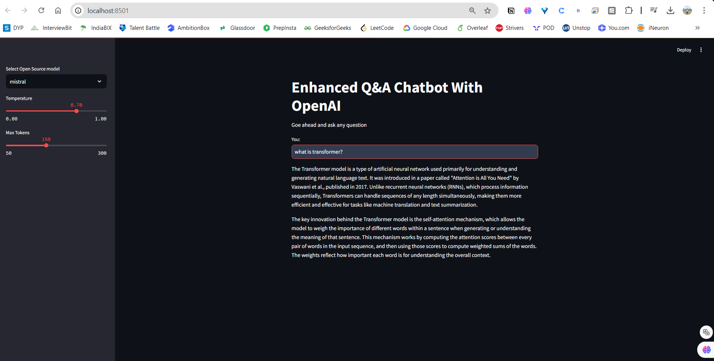
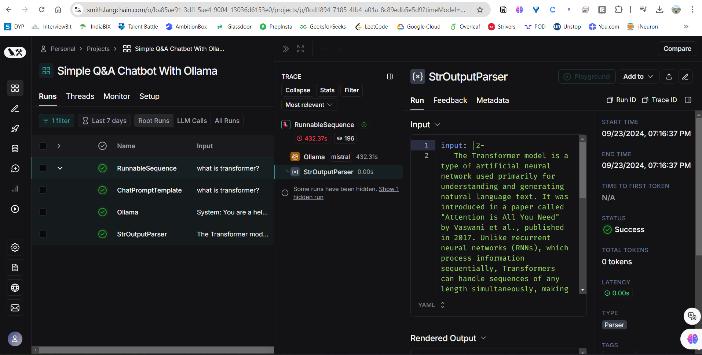

# Q&A ChatBot with Ollama Models

A chatbot system that uses the Ollama framework or models to answer user queries.

## Use Cases:

Customer Support: Automating responses to frequently asked questions.
Information Retrieval: Providing answers from a knowledge base or database.
Educational Tools: Helping users learn by answering questions on various topics.

## Results

